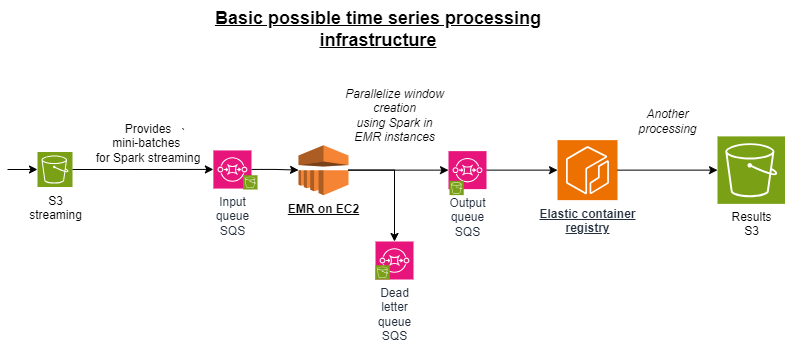

# Time Series Processing Pipeline (Terraform Demo)

This repository contains Terraform configurations for deploying a basic time series processing infrastructure on AWS. This project serves as a hands-on learning experience for using Terraform to provision cloud resources.

## Project Goal

The primary goal of this project is to learn Terraform by deploying a simplified version of a large-volume time series processing pipeline.

## Architecture

The deployed architecture, inspired by common big data processing patterns, includes:

- S3 Buckets: For ingesting raw time series data and storing processed results.
- SQS Queues: To manage the flow of messages and orchestrate processing steps, including a dead-letter queue for failed messages.
- EMR on EC2: To leverage Spark for parallelized window creation on time series data (*I will sustitute it by EC2 instances as I don't have free access to EMR*).
- Elastic Container Registry (ECR): For storing container images used in subsequent processing steps.

The diagram below illustrates the intended architecture:

## What You'll Find Here

- Terraform configuration files (.tf) to define and deploy the AWS resources.
- (Potentially) Example scripts or code illustrating the data flow (though the focus is on infrastructure).

## How to Use (and Learn)

1. Clone this repository.
2. Ensure you have Terraform [installed](https://developer.hashicorp.com/terraform/tutorials/aws-get-started/install-cli) and AWS credentials [configured](https://docs.aws.amazon.com/cli/v1/userguide/cli-chap-configure.html).
3. Explore the Terraform files to understand how each resource is defined.
4. Run `terraform init` to initialize your working directory.
5. Run `terraform plan` to see the resources that will be created.
6. Run `terraform apply` to deploy the infrastructure to your AWS account.
7. Experiment! Modify the configurations, add new resources, or destroy and recreate the environment.
8. Run `terraform destroy` when you're finished to clean up the deployed resources.